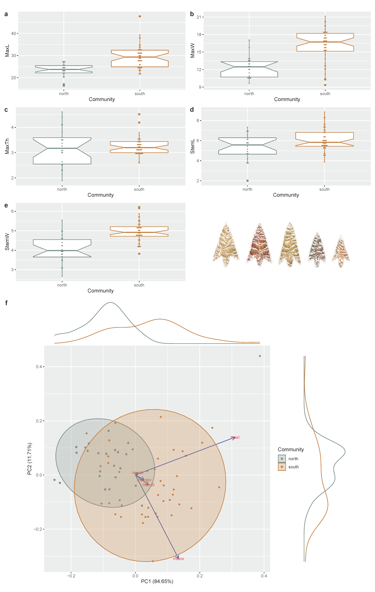

# Perdiz arrow points from Caddo burial contexts aid in defining discrete behavioral regions

Recent research in the ancestral Caddo area has yielded evidence for distinct _behavioral regions_, across which material culture from Caddo burials-Hickory Engraved and Smithport Plain bottles as well as Gahagan bifaces-have been found to express significant morphological differences. This inquiry assesses whether Perdiz arrow points from Caddo burials, assumed to reflect design intent, may differ across the same geography, and extend the pattern of shape differences to a third category of Caddo material culture. Perdiz arrow points collected from the geographies of the northern and southern Caddo communities of practice defined in a recent social network analysis were employed to test the hypothesis that morphological attributes differ, and are predictable, between the two communities. Results indicate significant between-community differences in maximum length, width, stem length, and stem width, but not thickness. Using the same traditional metrics combined with the tools of machine learning, a predictive model---support vector machine---was designed to assess the degree to which community differences could be predicted, achieving a receiver operator curve score of 97 percent, and an accuracy score of 94 percent. The subsequent geometric morphometric analysis identified significant differences in Perdiz arrow point shape and size, coupled with significant results for modularity and morphological integration. These findings bolster the argument for the establishment of at least two discrete _behavioral regions_ in the ancestral Caddo area defined by discernible morphological differences across three categories of Caddo material culture.

Supplementary materials: [https://seldenlab.github.io/perdiz3/](https://seldenlab.github.io/perdiz3/)

