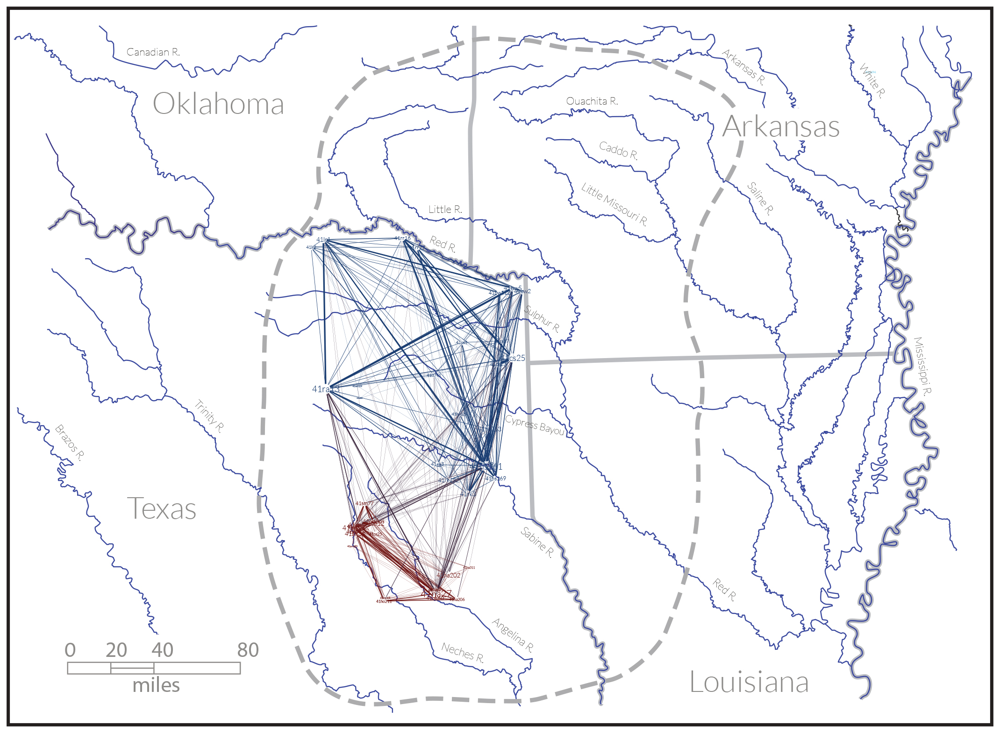
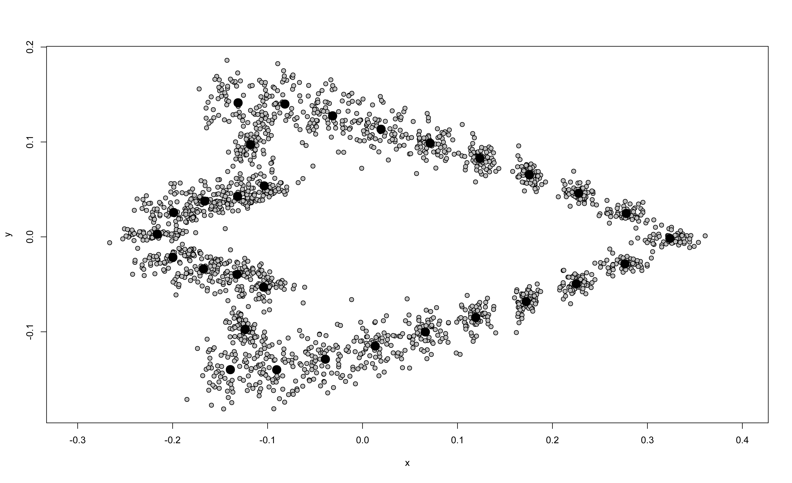
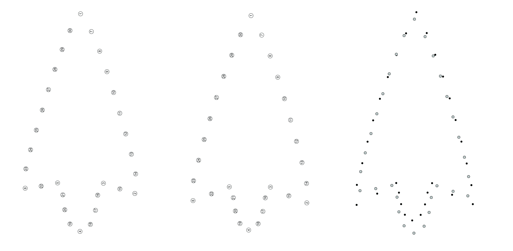

# Introduction {#intro}

Perdiz arrow points generally follow two distinct manufacturing trajectories; one that enlists flakes, and the other, blade flakes \cite{RN8999,RN9361,RN9000,RN9364}. Lithic tool stone in the Caddo area of northeast Texas is relatively sparse, consists primarily of chert, quartzite, and silicified wood characteristic of the local geological formations, which may contribute to local variation in both morphology and size \cite{RN9364,RN439}. It has been demonstrated elsewhere that Perdiz arrow points from northeast Texas vary significantly by time, raw material, and burial context \cite{RN9364}. In outline, Perdiz arrow points possess a:

>[t]riangular blade with edges usually quite straight but sometimes slightly convex or concave. Shoulders sometimes at right angles to stem but usually well barbed. Stem contracted, often quite sharp at base, but may be somewhat rounded. Occasionally, specimen may be worked on one face only or mainly on one face … [w]orkmanship generally good, sometimes exceedingly fine with minutely serrated blade edges \cite[504]{RN5769}.

A social network analysis of Historic Caddo (post-CE 1680) sites in northeast Texas demonstrated two spatially distinct _behavioral regions_ \cite{RN8031} (Fig. 1). The network analysis was limited to Historic Caddo types; however, Formative Early Caddo (CE 800 – 1200) Gahagan bifaces and Caddo bottle types have been found to express significantly different morphologies between the same two areas \cite{RN8074,RN7927,RN8370,RN8312}, extending the temporal range of the shape boundary. Gahagan bifaces from the ancestral Caddo area also differ significantly in shape, size, and form from those recovered at central Texas sites \cite{RN8322}, suggestive of a second shape boundary between the Caddo region and central Texas.

```{r fig1, out.width = "100%", dpi = 300, echo=FALSE, warning=FALSE, fig.cap="Historic Caddo network generated using ceramic and lithic types, which include Perdiz arrow points (DOI 10.17605/OSF.IO/WD2ZT), illustrating the two (north [blue] and south [red]) Caddo behavioral regions. The regions were identified using a modularity statistic to identify those nodes more densely connected to one another than to the rest of the network ."}

```

The goal of this exploratory endeavor was to assess whether traditional metrics collected for Perdiz arrow points support the _shape boundary_ posited in recent social network and geometric morphometric analyses, to determine whether linear metrics might be useful predictors of regional membership, and—if so—to identify those morphological features that articulate with each _behavioral region_ using geometric morphometrics. It is assumed that complete Perdiz arrow points included as offerings in Caddo burials represent the design intent of the maker. Should the analysis yield significant results, it would bolster the argument for at least two discrete Caddo _behavioral regions_; each empirically defined by discernible morphological differences across three discrete categories of Caddo material culture.

## _Caddo behavioral regions_

In a June 18, 1937 Works Progress Administration interview with Lillian Cassaway, Sadie Bedoka—a Caddo-Delaware woman raised with the Caddo—stated that:

>Each [Caddo] clan had its own shape to make its pottery. One clan never thought of making anything the same pattern of another clan. _You could tell who made the pottery by the shape_ \cite[395]{RN9357x}.

General differences in Caddo ceramic forms have been noted elsewhere \cite{RN5650,RN7129,RN7162}; however, the study of the Clarence H. Webb collection was the first to illustrate a significant north-south geographic shape difference among Hickory Engraved and Smithport Plain Caddo bottle types \cite{RN8370}. That preliminary observation was later confirmed using more robust samples of Hickory Engraved and Smithport Plain bottles \cite{RN8074,RN7927}, then expanded to include a greater variety of Caddo bottle types across a larger spatial extent \cite{RN8312}.

The co-presence of diagnostic artifact and attribute types have been used to define the Caddo phases and periods that serve as a heuristic tool to aid archaeologists in explaining the local cultural landscape. The Historic Caddo network expounds upon those efforts, by building upon the previously defined phases and periods, and emphasizing the dynamic and manifold relational connections that transcend the currently-defined categories \cite{RN8031}. This was achieved by enlisting a multi-scalar methodological approach \cite{RN5644,RN8039}, where the northern and southern communities were parsed into constituent groups using diagnostic types paired with a modularity statistic \cite{RN8051,RN8024}. A number of the constituent groups identified by the networks were found to articulate with known Caddo polities, while others were not \cite{RN8031}. 

A subsequent analysis of Gahagan bifaces confirmed that a second category of Caddo material culture expressed significant morphological differences across the same geography as the Hickory Engraved and Smithport Plain bottles \cite{RN8158}. The morphology of Gahagan bifaces from sites in central Texas was later found to differ significantly when compared with those recovered from the Caddo region \cite{RN8322}. That Gahagan bifaces were found to differ across two spatial boundaries was noteworthy, particularly since it has regularly been assumed that these large bifaces were manufactured in central Texas and arrived in the ancestral Caddo area as products of trade or exchange \cite{RN8322,RN8158}. Further, that Gahagan bifaces were found to differ across the same geography as those communities posited in the Historic Caddo network analysis suggested that the temporal range of the shape boundary might extend to the Formative/Early Caddo period (CE 800 - 1250); a hypothesis that was later confirmed in a more comprehensive analysis of Caddo bottles \cite{RN8312}.

Perdiz arrow points were among the diagnostic artifact types included in the Historic Caddo network analysis \cite{RN8031}, and it is expected that they will differ across the shape boundary; however, it remains unknown whether Caddo Perdiz arrow points might be said to differ by or through temporal periods in the northern and southern communities. 

# Methods and results

The sample of Perdiz arrow points used in this study consists of 67 intact specimens from Caddo burials in Camp, Nacogdoches, and Shelby counties ([supplementary materials](https://seldenlab.github.io/perdiz3/)). A standard suite of linear metrics was collected for each specimen, including maximum length, width, thickness, stem length, and stem width. Following collection, data were imported to R ([supplementary materials](https://seldenlab.github.io/perdiz3/)), where boxplots were produced, along with a Principal Components Analysis (PCA) followed by analyses of variance (ANOVA) to test whether the morphology of Perdiz arrow points differs across the shape boundary (Fig.2).

Boxplots illustrate the distribution and means for each of the five variables (Fig. 2a-e), and the PCA (Fig. 2f) illustrates over 92 percent of the variation in the sample among PC1 (84.65 percent) and PC2 (11.71 percent). The ANOVAs demonstrate significant differences in Perdiz arrow point morphology among four of the five variables (maximum length, width, stem length, and stem width) ([supplementary materials](https://seldenlab.github.io/perdiz3/)). Maximum thickness does not differ significantly between the northern and southern communities, which led to the decision to conduct the subsequent geometric morphometric analysis as a two dimensional, rather than a three-dimensional, study ([supplementary materials](https://seldenlab.github.io/perdiz3/)).

```{r fig2, out.width = "95%", dpi = 300, echo=FALSE, warning=FALSE, fig.cap="Boxplots for a, maximum length; b, maximum width; c, maximum thickness; d, stem length; e, stem width, and f, PCA for linear metrics associated with the Perdiz arrow points. Additional information related to the analysis, including data and code needed to reproduce these results, can be found in the supplemental materials at https://seldenlab.github.io/perdiz3/."}
knitr::include_graphics("ms-figs/figure2.pdf")
```

## _Predictive model_

For the support vector machine, linear data were imported to Python ([supplementary materials](https://seldenlab.github.io/perdiz3/)), where they were split into training (75 percent) and testing (25 percent) subsets. A standard scaler was used to decrease the sensitivity of the algorithm to outliers by standardizing features, and a nested cross validation of the training set was used to achieve unbiased estimates of model performance, resulting in a mean cross validation score of 86 percent ([supplementary materials](https://seldenlab.github.io/perdiz3/)). The model was subsequently fit on the training set, yielding a receiver operator curve score of 97 percent, and an accuracy score of 94 percent ([supplementary materials](https://seldenlab.github.io/perdiz3/)).

## _Geometric morphometrics_

Each of the arrow points was imaged using a flatbed scanner (HP Scanjet G4050) at 600 dpi. The landmarking protocol developed for this study ([supplementary materials](https://seldenlab.github.io/perdiz3/)) includes six landmarks and 24 equidistant semilandmarks to characterize Perdiz arrow point shape, and were applied using the `StereoMorph` package in R \cite{RN8973}. The characteristic points and tangents used in the landmarking protocol were inspired by the work of Birkhoff \cite{RN5700}.

Landmark data were aligned to a global coordinate system \cite{RN8102,RN8587,RN8384}, achieved through generalized Procrustes superimposition \cite{RN8525} performed in R 4.1.1 \cite{RN8584} using the `geomorph` package v4.0.0 \cite{RN8565}. Procrustes superimposition translates, scales, and rotates the coordinate data allowing for comparisons among objects \cite{RN5698,RN8525}. The `geomorph` package uses a partial Procrustes superimposition that projects the aligned specimens into tangent space subsequent to alignment in preparation for the use of multivariate methods that assume linear space \cite{RN8511,RN8384} (Fig.3). 

```{r fig3, out.width = "100%", dpi = 300, echo=FALSE, warning=FALSE, fig.cap="Results of generalized Procrustes analysis, illustrating mean shape (black) and all specimens in the sample (gray). Additional information related to the GPA, including those data and code needed to reproduce these results, can be found in the supplemental materials at https://seldenlab.github.io/perdiz3/."}

```

Principal components analysis (Jolliffe 2002) was used to visualize shape variation among the arrow points (Fig. 4). The shape changes described by each principal axis are commonly visualized using thin-plate spline warping of a reference 3D mesh (Klingenberg 2013; Sherratt, et al. 2014). A residual randomization permutation procedure (RRPP; n = 10,000 permutations) was used for all Procrustes ANOVAs (Adams and Collyer 2015; Collyer and Adams 2018), which has higher statistical power and a greater ability to identify patterns in the data should they be present (Anderson and Ter Braak 2003). To assess whether shape changes with size (allometry), and differs by group (region), Procrustes ANOVAs (Goodall 1991) were also run that enlist effect-sizes (z-scores) computed as standard deviates of the generated sampling distributions (Collyer, et al. 2015). Procrustes variance was used to discriminate between regions and compare the amount of shape variation (morphological disparity) (Zelditch, et al. 2004), estimated as the Procrustes variance using residuals of linear model fit (Adams, et al. 2018). A pairwise comparison of morphological integration was used to test the strength of integration between blade and basal morphology using a z-score  (Adams and Collyer 2016).

```{r fig4, out.width = "100%", dpi = 300, echo=FALSE, warning=FALSE, fig.cap="Principal components analysis plot (PC1/PC2) for Perdiz arrow points by community (top; gray squares, north; orange triangles, south), and results of modularity (bottom left) and blade/base morphological integration (bottom right) analyses. Additional information related to the PCA, including the full listing of results and those data and code needed to reproduce these results, can be found in the supplemental materials at https://seldenlab.github.io/perdiz3/."}
knitr::include_graphics("ms-figs/figure4.jpg")
```

A Procrustes ANOVA was used to test whether a significant difference exists in Perdiz arrow point (centroid) size, and results indicate a significant difference (RRPP = 10,000; Rsq = 0.30681; Pr(>F) = 1e-04). A second Procrustes ANOVA was used to test whether a significant difference exists in arrow point shape by region (northern vs. southern communities), and results indicate a significant difference (RRPP = 10,000; Rsq = 0.0536; Pr(>F) = 0.0161). A comparison of mean consensus configurations was used to characterize intraspecific shape variation of Perdiz arrow points from the northern and southern _behavioral regions_. Differential morphology occurs in the basal area, where the angle between the shoulder and base is more acute, with a base that is generally shorter and narrower in the southern _behavioral region_ than it is to the north (Fig. 5).

```{r fig5, out.width = "100%", dpi = 300, echo=FALSE, warning=FALSE, fig.cap="Mean shapes for Perdiz arrow points from the northern (a, left), and southern (b, center) behavioral region. In the comparison of the two (c, right), the northern behavioral region is represented by gray circles, and the southern, by black. Additional information related to the mean shapes, including those data and code needed to reproduce these results, can be found in the supplemental materials at https://seldenlab.github.io/perdiz3/."}

```

# Discussion

The previously-defined communities of practice can now be extended to include Perdiz arrow points as a third category of Caddo material culture (bottles, bifaces, and arrow points) that differs significantly in morphology across the shape boundary. The shape boundary delineates—empirically—two discrete behavioral regions in the Caddo region.  

Recent geometric morphometric studies have illustrated a clearly discernible shape boundary between the northern and southern Caddo behavioral regions that transcends three artifact categories from the Formative through Historic Caddo periods. This study clearly illustrates that those morphological differences among Perdiz arrow points found in the northern and southern behavioral regions are predictable, and can be identified using the standard suite of linear metrics regularly collected as part of cultural resource management endeavors.

That the Perdiz arrow points from Caddo burials in the northern and southern communities differ expands the scope to include a third class of artifacts that include Caddo bottles, bifaces, and—now—arrow points (Selden Jr, et al. 2021; Selden Jr. 2018a, 2018b, 2019, 2021b; Selden Jr., et al. 2020; Selden Jr., et al. 2018). 

# Acknowledgments {-}

We express our gratitude to the Caddo Nation of Oklahoma and the Anthropology and Archaeology Laboratory at Stephen F. Austin State University for the requisite permissions and access to the NAGPRA objects from the Washington Square Mound site and Turner collections, and to Tom A. Middlebrook for brokering access to the Perdiz arrow points from burials at the Morse Mound site. Thanks also to the editor and reviewers for their useful comments and constructive criticisms, which further improved this manuscript.

# Data Management {-}

The data and analysis code associated with this project can be accessed through the GitHub repository ([https://github.com/seldenlab/perdiz3](https://github.com/seldenlab/perdiz3)) or the supplementary materials ([https://seldenlab.github.io/perdiz3/](https://seldenlab.github.io/perdiz3/)); which are digitally curated on the Open Science Framework at \newline DOI: 10.17605/OSF.IO/UK9ZD. 
