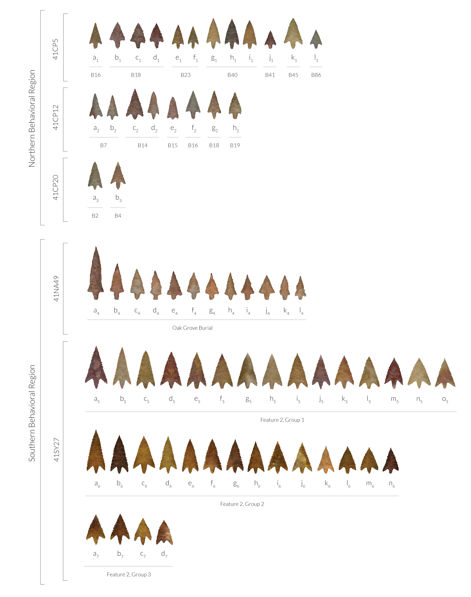

# Introduction {#intro}

Perdiz arrow points (Fig.1) are considered the epitome of the Late Prehistoric Toyah lithic assemblage in Texas---which also includes convex end scrapers or unifaces, prismatic blades, as well as two- and four-beveled bifacial knives---and are representative of the Late Prehistoric transition to the Protohistoric \cite{RN9718}. This technological assemblage is typically attributed to groups of highly mobile bison hunters, and has been documented across the full extent of Texas. Our present understanding of the Toyah tool kit indicates that it was successfully implemented in a broad-spectrum of hunting and foraging lifeways that included not only bison (_Bison bison_), but deer (_Odocoileus spp._) and numerous other animal prey species \cite{RN9718,RN9786}.

```{r fig0, out.width = "100%", dpi = 300, echo=FALSE, warning=FALSE, fig.cap="Perdiz arrow points used in this study come from Caddo burial contexts at the Tuck Carpenter (41CP5), Johns (41CP12), B. J. Horton (41CP20), Washington Square Mound (41NA49), and Morse Mound (41SY27) sites in northeast Texas. Additional information for each Perdiz arrow point, including the option to download full-resolution 2D images of individual projectiles, can be found at https://scholarworks.sfasu.edu/ita-perdiz/."}

```

While Perdiz arrow points have not been used to address more complex research issues, the Toyah tool kit was recognized as a potential contributor to discussions of Late Prehistoric social and cultural identity. Initially identified  by J. Charles Kelley on the basis of technological and morphological differences in material culture, the Toyah Phase (CE 1300 - 1700) occured between the Protohistoric and the preceding Austin Phase of the Late Prehistoric Period \cite{RN9719,RN9720}. As noted by Arnn:

>Toyah represents something of a paradox in which archaeologists have identified one archaeological or material culture in the same region where historians have documented numerous Native American groups and significant cultural diversity \cite[47]{RN9718}.

Stemming from the observations of Kelley, as well as later researchers who viewed Toyah as a cultural entity, technological origins became a point of further interest and debate from which two schools of thought emerged regarding Toyah cultural manifestations: 1) that Toyah represented the technology of Plains groups moving into Texas following the bison herds \cite{RN9721,RN9722}, or 2) a _technocomplex_ or suite of artifacts adopted by multiple distinct groups across Texas as they participated in bison hunting \cite{RN9008,RN9723,RN9724}. In both interpretations, primary agency is environmental \cite{RN9718}; either people followed the bison from elsewhere, or the influx of bison spurred adoption of the technology among the numerous distinct groups in Texas.

Research by Arnn \cite{RN9718,RN9716,RN5784,RN9717} emphasized aspects of Toyah social identity, social fields, and agency, as well as the archaeological visibility of these phenomena. Arnn recognized three important scales of identity and interaction in his work: community/band, marriage/linguistic group, and long-distance social networks \cite{RN9718}. His ideas are important here because they supplant a simple monocausal environmental explanation of material culture variability with a multi-causal and scaled concept that includes _social identity_.

## Perdiz arrow points

Perdiz arrow points generally follow two distinct manufacturing trajectories; one that enlists flakes, and the other, blade flakes \cite{RN8999,RN9361,RN9000,RN9364}, and encompass a greater range of variation in shape and size than most arrow point types in Texas \cite{RN7795,RN3149}. Lithic tool stone in the ancestral Caddo area of northeast Texas is relatively sparse, consists primarily of chert, quartzite, and silicified wood characteristic of the local geological formations, which may contribute to local variation in shape and size \cite{RN9364,RN439}. It has been demonstrated elsewhere that morphological attributes of Perdiz arrow points from northeast Texas vary significantly by time, raw material, and burial context \cite{RN9364}. In outline, Perdiz arrow points possess a:

>[t]riangular blade with edges usually quite straight but sometimes slightly convex or concave. Shoulders sometimes at right angles to stem but usually well barbed. Stem contracted, often quite sharp at base, but may be somewhat rounded. Occasionally, specimen may be worked on one face only or mainly on one face … [w]orkmanship generally good, sometimes exceedingly fine with minutely serrated blade edges \cite[504]{RN5769}.

A social network analysis of diagnostic artifacts from Historic Caddo (post-CE 1680) sites in northeast Texas demonstrated two spatially distinct _behavioral regions_ \cite{RN8031} (Fig. 2). The network analysis was limited to Historic Caddo types; however, Formative Early Caddo (CE 800 – 1200) Gahagan bifaces and Caddo bottle types have been found to express significant morphological variability following the same geographic extent \cite{RN8074,RN7927,RN8370,RN8312}, extending the prehistoric longevity for the _behavioral regions_ based on local alterity. Gahagan bifaces from the ancestral Caddo area also differ significantly in shape, size, and form compared with those recovered from central Texas sites \cite{RN8322}, suggesting a second _shape boundary_ between the ancestral Caddo area and central Texas.

```{r fig1, out.width = "100%", dpi = 300, echo=FALSE, warning=FALSE, fig.cap="Historic Caddo network (CE 1680+) generated using the co-presence of diagnostic ceramic and lithic types---which include Perdiz arrow points---illustrating the ancestral Caddo region (gray outline) and the two (north [blue] and south [red]) Caddo behavioral regions [21]. The regions were identified using a modularity statistic to identify those nodes more densely connected to one another than to the rest of the network."}
knitr::include_graphics("ms-figs/figure1.jpg")
```

The goal of this exploratory endeavor was to assess whether metrics collected for Perdiz arrow points support the _shape boundary_ posited in recent social network and geometric morphometric analyses, to determine whether linear metrics and shape variables might be useful predictors of regional membership, and—if so—to identify those morphological features that articulate with each _behavioral region_. It is assumed that complete Perdiz arrow points included as offerings in Caddo burials represent the _design intent_ of the maker. Should the analysis yield significant results, it would bolster the argument for at least two discrete Caddo _behavioral regions_ in northeast Texas; each empirically defined by discernible morphological differences across three discrete categories of Caddo material culture.

## Caddo behavioral regions

In a June 18, 1937 Works Progress Administration interview with Lillian Cassaway, Sadie Bedoka—a Caddo-Delaware woman raised with the Caddo—stated that:

>Each [Caddo] clan had its own shape to make its pottery. One clan never thought of making anything the same pattern of another clan. _You could tell who made the pottery by the shape_ \cite[395]{RN9357x}.

General differences in Caddo ceramic forms have been noted elsewhere \cite{RN5650,RN7162}; however, the study of the Clarence H. Webb collection was the first to illustrate a significant north-south geographic shape difference among Hickory Engraved and Smithport Plain Caddo bottle types \cite{RN8370}. That preliminary observation was later confirmed using more robust samples of Hickory Engraved and Smithport Plain bottles \cite{RN8074,RN7927}, then expanded to include a greater variety of Caddo bottle types across a larger spatial and temporal extent \cite{RN8312}.

The co-presence of diagnostic artifact and attribute types has been used to define Caddo phases and periods, which serve as a heuristic tool that aids archaeologists in explaining the local cultural landscape, as well as regional differences between local landscapes. The Historic Caddo network expands those efforts, augmenting the previously-defined phases and periods, and emphasizing the dynamic and manifold relational connections that reinforce and transcend the currently categories \cite{RN8031}. This was achieved by enlisting a multi-scalar methodological approach \cite{RN5644,RN8039}, where northern and southern communities were parsed into constituent groups using the co-presence of diagnostic types paired with a modularity algorithm \cite{RN8051,RN8024}. Most of the constituent groups identified in the network analysis were found to articulate with known Caddo polities, while others were not \cite{RN8031}. 

A subsequent analysis of Gahagan bifaces confirmed that a second category of Caddo material culture expressed significant morphological differences across the same geography as the Hickory Engraved and Smithport Plain bottles \cite{RN8158}. The morphology of Gahagan bifaces from sites in central Texas was later found to differ significantly when compared with those recovered from the Caddo region \cite{RN8322}. That Gahagan bifaces were found to differ across two _spatial boundaries_ was noteworthy, particularly since it has regularly been assumed that these large bifaces were manufactured in central Texas and arrived in the ancestral Caddo area as products of trade and/or exchange \cite{RN8322,RN8158}. Further, that Gahagan bifaces were found to differ across the same geography as those communities posited in the Historic Caddo network analysis suggested that the temporal range of the _shape boundary_ might extend to the Formative/Early Caddo period (CE 800 - 1250); a hypothesis that was later confirmed in a more comprehensive analysis of Caddo bottles \cite{RN8312}.

# Methods and results

Sixty seven intact Perdiz arrow points recovered from Caddo burial contexts in Camp, Nacogdoches, and Shelby counties comprise the basis of this study ([supplementary materials](https://seldenlab.github.io/perdiz3/)). A standard suite of linear metrics were collected for each specimen, including maximum length, width, thickness, stem length, and stem width. Following collection, data were imported to R 4.1.1 \cite{RN8584} ([supplementary materials](https://seldenlab.github.io/perdiz3/)), where boxplots were produced, along with a Principal Components Analysis (PCA) followed by analyses of variance (ANOVA) to test whether the morphology of Perdiz arrow points differs across the shape boundary (Fig.2).

Boxplots illustrate the distribution and mean for each of the five variables (Fig. 3a-e), and the PCA (Fig. 3f) illustrates over 92 percent of the variation in the sample among PC1 (84.65 percent) and PC2 (11.71 percent). ANOVAs demonstrate significant differences in Perdiz arrow point morphology among four of the five variables (maximum length, width, stem length, and stem width) ([supplementary materials](https://seldenlab.github.io/perdiz3/)). Maximum thickness does not differ significantly between the northern and southern communities, which led to the decision to conduct the subsequent geometric morphometric analysis as a two dimensional, rather than a three-dimensional, study ([supplementary materials](https://seldenlab.github.io/perdiz3/)).

```{r fig2, out.width = "95%", dpi = 300, echo=FALSE, warning=FALSE, fig.cap="Boxplots for a, maximum length; b, maximum width; c, maximum thickness; d, stem length; e, stem width, and f, PCA for linear metrics associated with the Perdiz arrow points. Additional information related to the analysis, including data and code needed to reproduce these results, can be found in the supplemental materials at https://seldenlab.github.io/perdiz3/."}
knitr::include_graphics("ms-figs/figure2.pdf")
```

## Predictive model

A _support vector machine_ is a supervised machine learning model regularly used in classifying archaeological materials \cite{RN9515,RN9516,RN9514,RN9513,RN10755,RN10754}, which has utility in comparing and classifying datasets aggregated from digital repositories, comparative collections, open access reports, as well as other digital assets. For this effort, linear data were imported and modeled using the `scikit-learn` package in Python \cite{scikit-learn,sklearn_api} ([supplementary materials](https://seldenlab.github.io/perdiz3/)), and subsequently split into training (75 percent) and testing (25 percent) subsets. A _standard scaler_ was used to decrease the sensitivity of the algorithm to outliers by standardizing features, and a _nested cross validation_ of the training set was used to achieve unbiased estimates of model performance, resulting in a mean cross validation score of 86 percent ([supplementary materials](https://seldenlab.github.io/perdiz3/)). The model was subsequently fit on the training set, yielding a receiver operator curve score of 97 percent, and an accuracy score of 94 percent ([supplementary materials](https://seldenlab.github.io/perdiz3/)).

## Geometric morphometrics

Each of the arrow points was imaged using a flatbed scanner (HP Scanjet G4050) at 600 dpi. The landmarking protocol developed for this study ([supplementary materials](https://seldenlab.github.io/perdiz3/)) included six landmarks and 24 equidistant semilandmarks to characterize Perdiz arrow point shape, applied using the `StereoMorph` package in R \cite{RN8973}. The characteristic points and tangents used in the landmarking protocol were inspired by the work of Birkhoff \cite{RN5700}.

Landmarks were aligned to a global coordinate system \cite{RN8102,RN8587,RN8384}, achieved through generalized Procrustes superimposition \cite{RN8525}, performed in R 4.1.1 \cite{RN8584} using the `geomorph` package v4.0.1 \cite{RN8565,RN9565} (Fig.4). Procrustes superimposition translates, scales, and rotates the coordinate data allowing for comparisons among objects \cite{RN5698,RN8525}. The `geomorph` package uses a partial Procrustes superimposition that projects the aligned specimens into tangent space subsequent to alignment in preparation for the use of multivariate methods that assume linear space \cite{RN8511,RN8384}.

```{r fig3, out.width = "100%", dpi = 300, echo=FALSE, warning=FALSE, fig.cap="Results of generalized Procrustes analysis, illustrating mean shape (black) and all specimens in the sample (gray). Additional information related to the GPA, including those data and code needed to reproduce these results, can be found in the supplemental materials at https://seldenlab.github.io/perdiz3/."}
knitr::include_graphics("ms-figs/figure3.jpg")
```

Principal components analysis \cite{RN8576} was used to visualize shape variation among the arrow points (Fig. 5). The shape changes described by each principal axis are commonly visualized using thin-plate spline warping of a reference image or 3D mesh \cite{RN8555,RN8553}. A residual randomization permutation procedure (RRPP; n = 10,000 permutations) was used for all Procrustes ANOVAs \cite{RN8579,RN8334}, which has higher statistical power and a greater ability to identify patterns in the data should they be present \cite{RN6995}. To assess whether shape changes with size (allometry), and differs by group (region), Procrustes ANOVAs \cite{RN7046} were also run that enlist effect-sizes (z-scores) computed as standard deviates of the generated sampling distributions \cite{RN8477}. Procrustes variance was used to discriminate between regions and compare the amount of shape variation (morphological disparity) \cite{RN5703}, estimated as Procrustes variance using residuals of linear model fit \cite{RN8314}. A pairwise comparison of morphological integration was used to test the strength of integration between blade and basal morphology using a z-score \cite{RN8340}.

```{r fig4, out.width = "100%", dpi = 300, echo=FALSE, warning=FALSE, fig.cap="Principal components analysis plot (PC1/PC2) for Perdiz arrow points by behavioral region/community (top; gray squares, north; orange triangles, south), and results of modularity (bottom left) and blade/base morphological integration (bottom right) analyses. Additional information related to the PCA, including the full listing of results and those data and code needed to reproduce these results, can be found in the supplemental materials at https://seldenlab.github.io/perdiz3/."}
knitr::include_graphics("ms-figs/figure4.jpg")
```

The analysis of modularity, which compares within-module covariation of landmarks against between-module covariation was significant (Fig. 4 and [supplementary materials](https://seldenlab.github.io/perdiz3/)), demonstrating that Perdiz arrow point blades and bases are, in fact, modular. The test for morphological integration was also significant (Fig. 4 and [supplementary materials](https://seldenlab.github.io/perdiz3/)), indicating that the blades and bases of Perdiz arrow points are integrated. These results demonstrate that blade and base shapes for Perdiz arrow points are predictable; a finding that would have utility in subsequent studies of Perdiz arrow point morphology that incorporate fragmentary specimens.

A Procrustes ANOVA was used to test whether a significant difference exists in Perdiz arrow point (centroid) size (RRPP = 10,000; Rsq = 0.30681; Pr(>F) = 1e-04), followed by another to test whether a significant difference exists in arrow point shape by region (northern vs. southern) (RRPP = 10,000; Rsq = 0.0536; Pr(>F) = 0.0161). A comparison of mean consensus configurations was used to characterize intraspecific shape variation of Perdiz arrow points from the northern and southern _behavioral regions_. Diacritical morphology occurs primarily in basal shape, where the angle between the shoulder and base is more acute, and a base that is generally shorter and narrower in the southern _behavioral region_ than it is in the north ([supplementary materials](https://seldenlab.github.io/perdiz3/)).

# Discussion

The _shape boundary_ empirically delineates two discrete _behavioral regions_ in the ancestral Caddo area. That the Perdiz arrow points recovered from Caddo burials north and south of the _shape boundary_ were found to differ significantly, expands the scope of the _behavioral regions_ to include three classes of artifacts (Caddo bottles, bifaces, and—now—arrow points) \cite{RN8074,RN7927,RN8370,RN8312,RN8322,RN8158}. For material culture offerings included in burial contexts, the Caddo were _selecting_ for significant morphological differences in bottles and bifaces recovered from either side of the _shape boundary_ (Fig. 6). Results clearly illustrate that those morphological differences among Perdiz arrow points found in the northern and southern _behavioral regions_ (Fig. 6d) are predictable ([supplementary materials](https://seldenlab.github.io/perdiz3/)), and can be disaggregated using the standard suite of linear metrics regularly collected in the context of cultural resource management endeavors.

```{r fig5, out.width = "100%", dpi = 300, echo=FALSE, warning=FALSE, fig.cap="Mean shapes and comparisons for a, Formative/Early and b, Late/Historic bottles; c, Formative/Early Gahagan bifaces; and d, Middle/Late Perdiz arrow points from Caddo burial contexts in the northern and southern behavioral regions. In the comparisons of mean shape, the northern population appears in gray, and the southern population appears in black."}
knitr::include_graphics("ms-figs/figure6.png")
```

The geometric morphometric analysis demonstrated significant morphological differences for Perdiz arrow points recovered north and south of the _shape boundary_, where the most pronounced difference was found to occur in basal morphology (Fig. 6). Allometry was also found to be significant, demonstrating that Perdiz arrow point shape differs with size. Those arrow points used in this study are considered to represent _design intent_, and are not thought to exhibit retouch or resharpening. This finding provides evidence in support of the argument that Perdiz arrow point morphology is labile \cite{RN9364}. The character of those morphological differences found to occur in Perdiz arrow points (basal morphology and size) is also suggestive of differential approaches to the practice of hafting.

Blades and bases of Perdiz arrow points were found to be both modular and morphologically integrated. This indicates that each module functions independently, and that base shape is a predictor of blade shape, and vice-versa. Further work is warranted to assess whether Perdiz arrow points from groups within the boundaries of the northern and southern _behavioral regions_ may express unique morphologies, aiding in further delimiting local boundaries associated with constituent Caddo groups.

## Standardization and specialization

Standardization has been conceptually linked to the notion of approximating a perceived ideal through the realization of a mental template \cite[156]{RN9715}. Morphological attributes are representative of intentional attributes related to morphological characteristics \cite{RN7051}, and dimensional standardization has utility in identifying the range of variation and overlap of product morphology both in and between communities \cite{RN5779}. Further, relative dimensional standardization may imply a smaller number of production units when contrasted with larger units \cite{RN7051}. Standardization can also result from raw material selection and (for lithics) reduction practices \cite{RN9712,RN9713,RN6494,RN9714}.

One common argument used to establish the presence of specialization includes large quantities of highly standardized products interpreted as representative of a single---or limited number of---production units \cite{RN7019}. There also exists the possibility that an increase in specialization can result in increased morphological diversity, depending on the organization of production \cite{RN6451}. Correlations between specialization and standardization have often, but not always, been supported by ethnographic and experimental data \cite{RN9725,RN9726,RN7137}. In the case of material culture from Caddo burials in the northern and southern _behavioral regions_, bottle and biface morphologies communicate important information related to group affiliation \cite{RN9727} through deliberate and differential production (bottles) and aesthetic choices (bifaces). Differences in Caddo bottle morphology have aided in the identification of two large production units; one in each of the _behavioral regions_, and it is likely the case that each is comprised of a series of smaller constituent production units bounded by geography and time.

While Caddo bottles are representative of a complete system---or unit---the function of a biface (Perdiz arrow points and Gahagan bifaces in this context) is more limited, in that they represent a singular component of a much more dynamic system. Dimensional standardization in size has been identified for both the Caddo bottles and Gahagan bifaces \cite{RN8074,RN7927,RN8370,RN8312,RN8322}. The similarities and differences in bottle shapes were found to transcend typological assignments, and bottles from the northern _behavioral region_ have been found to express a significantly greater diversity in size, yielding evidence for size standardization in the southern _behavioral region_ \cite{RN8312}. It is also the case that Gahagan bifaces from the ancestral Caddo area have been found to express a significantly greater diversity in size compared to those from central Texas \cite{RN8322}. These findings suggest that social and manufacturing tolerances, as they relate to Caddo burial traditions, may have been guided by regionally-specific morphological traits that signaled group _identity_.
 
## Morphologically-distinct behavioral regions

In considering the role(s) of artifacts as aspects of _social identity_, it is important not to lose sight of the fact that people and artifacts are active agents in the production and maintenance of _social identity(ies)_. Both categories of artifacts (bottles and bifaces) contribute to local and regional _communities of identity_ and _communities of practice_ \cite{RN8061}. Generally, this concept may be more easily applied to bottles since they were manufactured and used by individuals sharing collective _Caddo identities_. Bifaces (Perdiz arrow points and Gahagan bifaces) potentially represent multiple _identities_---those being the Caddo, as users; and non-Caddo, as producers---at least with regard to chipped stone tools incorporated in mortuary contexts. This idea lends defensible credence to the concept of morphologically-distinct _behavioral regions_ among the Caddo, while integrating the possibility of understanding interactions between Caddo and non-Caddo groups, to include the movement of material culture between Caddo _behavioral regions_.

Three categories of Caddo material culture differ north and south of the _shape boundary_, indicating a haecceity of regionally-distinct perspectives related to production (bottles), and aesthetic choice/cultural interaction (bifaces). These differing perspectives incorporate group decisions that include shape, size, form, and decorative expression, which likely represent the culmination of generational perspectives \cite{RN5610}. Simply stated, such perspectives are representative of tradition. Eckert and colleagues \cite{RN8061} indicate that provenance, the origin or source of an item, is a significant component of understanding the interrelatedness of _communities of identity_ and _communities of practice_. Perdiz arrow points and Gahagan bifaces recovered north and south of the _shape boundary_ are morphologically distinct. A second _shape boundary_ demonstrates that Gahagan bifaces differ significantly between the ancestral Caddo region and central Texas, where they are currently thought to have been manufactured. This suggests that those _communities of practice_ that articulate with the production of chipped stone artifacts recovered from Caddo internments, are not Caddo. 

It is entirely possible that there are no _communities of practice_ at all for chipped stone artifacts recovered from Caddo mortuary contexts. However, there do appear to have been _communities of practice_ associated with Perdiz arrow points recovered from non-mortuary contexts in the ancestral Caddo area, which may more readily reflect the distinct retouch or resharpening approaches employed by Caddo knappers \cite{RN9364,RN8486}. Similar interpretations can be applied to Gahagan bifaces, as few have been reported outside of Caddo mortuary contexts. It may be more fitting to perceive of Perdiz arrow points and Gahagan bifaces as indicative of _communities of identity_ rather than _communities of practice_, due to the contextual discrepancy evinced through mortuary and non-mortuary settings. The provenance of bifaces from Caddo mortuary contexts can most assuredly be considered non-local, or produced outside of the ancestral Caddo region, based on multiple factors that include raw material, workmanship, morphology, and context.

# Conclusion

This study demonstrated that linear metrics and shape variables collected for Perdiz arrow points support the _shape boundary_ posited in recent social network and geometric morphometric analyses, and determined that the same metrics can be used to predict regional membership. Those morphological features that discriminate between Perdiz arrow points recovered from each _behavioral region_ were identified using geometric morphometrics, with substantive differences found to occur in the size and basal morphology of the projectiles. Blade and base shape were found to be both modular and morphologically integrated, suggesting that blade and base shapes are predictable. While evidence from one category---Caddo bottles---supports discussions of Caddo production, the other two---bifaces---more readily articulate with production activities outside of the region by non-Caddo makers. Such production activity is more likely to be localized than exchange systems, thus assumed to leave a clearer signature \cite{RN7019}. Further work is warranted to expand the scope of this research program to include analyses of differential production in the two _behavioral regions_ using a greater diversity of diagnostic Caddo artifact types.

# Acknowledgments {-}

We express our gratitude to the Caddo Nation of Oklahoma and the Anthropology and Archaeology Laboratory at Stephen F. Austin State University for the requisite permissions and access to the NAGPRA objects from the Washington Square Mound site and Turner collections, and to Tom A. Middlebrook for brokering access to the Perdiz arrow points from burials at the Morse Mound site. We wish to thank Michael J. Shott and Casey Wayne Riggs for their useful comments and constructive criticisms, which further improved this manuscript.

# Data Management {-}

The data and analysis code associated with this project can be accessed through the GitHub repository ([https://github.com/seldenlab/perdiz3](https://github.com/seldenlab/perdiz3)) or the supplementary materials ([https://seldenlab.github.io/perdiz3/](https://seldenlab.github.io/perdiz3/)); which are digitally curated on the Open Science Framework at \newline DOI: 10.17605/OSF.IO/UK9ZD. 
