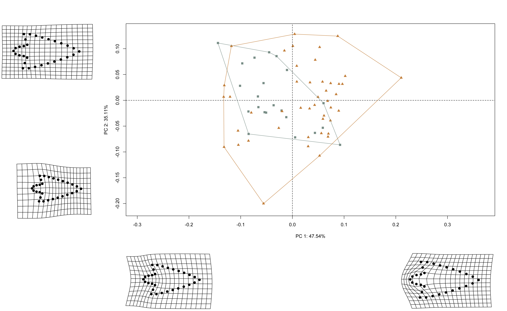

# Geometric morphometrics

## Load packages + data
```{r load, echo=TRUE, warning=FALSE}
# download most recent software version
#devtools::install_github("geomorphR/geomorph", ref = "Stable", build_vignettes = TRUE)
#devtools::install_github("mlcollyer/RRPP")

# load analysis packages
library(here)
library(StereoMorph)
library(geomorph)
library(ggplot2)
library(dplyr)
library(wesanderson)

# read shape data and define number of sLMs
shapes <- readShapes("shapes")
shapesGM <- readland.shapes(shapes, nCurvePts = c(10,3,5,5,3,10))

# read qualitative data
qdata <- read.csv("qdata.csv",
                  header = TRUE,
                  row.names = 1)
```

## Generalised Procrustes Analysis

```{r gpa, echo=TRUE, out.width = "100%", dpi = 300, warning=FALSE}
# gpa
Y.gpa <- gpagen(shapesGM, print.progress = FALSE)

## plot
plot(Y.gpa)

# dataframe
gdf <- geomorph.data.frame(shape = Y.gpa$coords,
                           size = Y.gpa$Csize,
                           region = qdata$region)

# add centroid size to qdata
qdata$csz <- Y.gpa$Csize
```

## Boxplot (centroid size)

```{r box, echo=TRUE, out.width = "100%", dpi = 300, warning=FALSE}
# attributes
csz <- qdata$csz
region <- qdata$region

# palette
pal = wes_palette("Moonrise2")

# boxplot of Perdiz arrow points by region
csz.temp <- ggplot(qdata, aes(x = region, y = csz, color = region)) +
  geom_boxplot(notch = TRUE) +
  geom_dotplot(binaxis = 'y', stackdir = 'center', dotsize = 0.3) +
  scale_color_manual(values = pal) +
  theme(legend.position = "none") +
  labs(x = 'Region', y = 'Centroid Size')

## render plot
csz.temp
```

## Principal Components Analysis

```{r pca, echo=TRUE, out.width = "100%", dpi = 300, warning=FALSE}
# pca
pca <- gm.prcomp(Y.gpa$coords)
summary(pca)

# set plot parameters
pch.gps <- c(15,17)[as.factor(region)]
col.gps <- pal[as.factor(region)]
col.hull <- c("#798E87", "#C27D38")

## pca plot
pc.plot <- plot(pca,
                asp = 1,
                pch = pch.gps,
                col = col.gps)
shapeHulls(pc.plot,
           groups = region,
           group.cols = col.hull)
```

### Minima/maxima of PC1/2 with warp grids

```{r min.max, echo=TRUE, out.width = "100%", dpi = 300, warning=FALSE}
# plot x/y maxima/minima
## x - minima
mean.shape <- mshape(Y.gpa$coords)
plotRefToTarget(pca$shapes$shapes.comp1$min, 
                mean.shape)

## x - maxima
plotRefToTarget(pca$shapes$shapes.comp1$max, 
                mean.shape)

## y - minima
plotRefToTarget(pca$shapes$shapes.comp2$min, 
                mean.shape)

## y - maxima
plotRefToTarget(pca$shapes$shapes.comp2$max, 
                mean.shape)
```

### Composite PCA with warp grids

```{r composite.pca, out.width = "100%", dpi = 300, echo=TRUE}
## plot composite pca with PC1/2 max/min

```

## Procrustes ANOVA: Allometry

```{r allom, echo=TRUE, out.width = "100%", dpi = 300, warning=FALSE}
# allometry
fit.size <- procD.lm(shape ~ size, 
                     data = gdf, 
                     print.progress = FALSE, 
                     iter = 9999)

# allometry
anova(fit.size)

# allometry plots
## regscore (Drake and Klingenberg 2008)
plot(fit.size, 
     type = "regression", 
     reg.type = "RegScore", 
     predictor = log(gdf$size), 
     pch = pch.gps, 
     col = col.gps)

## common allometric component (Mitteroecker 2004)
plotAllometry(fit.size, 
              size = gdf$size, 
              logsz = TRUE, 
              method = "CAC", 
              pch = pch.gps, 
              col = col.gps)

## size-shape pca (Mitteroecker 2004)
plotAllometry(fit.size, 
              size = gdf$size, 
              logsz = TRUE, 
              method = "size.shape", 
              pch = pch.gps, 
              col = col.gps)
```


## Procrustes ANOVA: Shape and size

```{r ss, echo=TRUE, out.width = "100%", dpi = 300, warning=FALSE}
# shape
fit.sh.reg <- procD.lm(shape ~ region,
                       data = gdf,
                       print.progress = FALSE,
                       iter = 9999)

# shape
anova(fit.sh.reg)

# size
fit.sz.reg <- procD.lm(size ~ region,
                       data = gdf,
                       print.progress = FALSE,
                       iter = 9999)

# size
anova(fit.sz.reg)
```

## Modularity

```{r mod, echo=TRUE, out.width = "100%", dpi = 300, warning=FALSE}
land.gps <- c("A","A","B","B","B","A","A","A","A","A","A","A","A","A",
              "B","B","B","B","B","B","B","B","A","A","A","A","A","A",
              "A","A")

mod <- modularity.test(Y.gpa$coords,
                       partition.gp = land.gps,
                       iter = 9999,
                       print.progress = FALSE)

summary(mod)

## modularity plot
plot(mod)
```

## Morphological integration

```{r integ, echo=TRUE, out.width = "100%", dpi = 300, warning=FALSE}
it <- integration.test(Y.gpa$coords,
                       partition.gp = land.gps,
                       print.progress = FALSE,
                       iter = 9999)

summary(it)

## integration plot
plot(it)
```

## Mean shapes

```{r mshape, echo=TRUE, out.width = "100%", dpi = 300, warning=FALSE}
# subset landmark coordinates to produce mean shapes
new.coords <- coords.subset(A = Y.gpa$coords,
                            group = qdata$region)
names(new.coords)

# group shape means
mean <- lapply(new.coords, mshape)

## plot mean shape north
plot(mean$north)

## plot mean shape south
plot(mean$south)

## comparison plot
plotRefToTarget(mean$north,
                mean$south,
                method = "points",
                mag = 2)

## composite figure
knitr::include_graphics('figures/gm-mshape.jpg')
```
